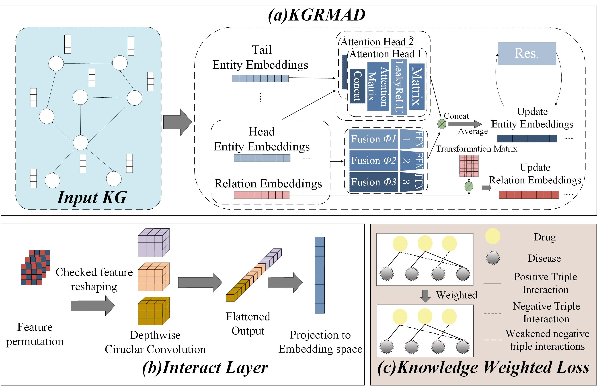

# MPTN

**This is the data and code for our paper** `KGRA: a knowledge graph relational attention model for drug repurposing`.

The development of new drugs is costly and time-consuming. Drug repurposing has gained popularity as an efficient and low-risk approach to find new therapeutic options by using drugs that have already been broadened to treat new diseases. Recently, knowledge graph-based methods have been used for drug repurposing. These models predict new drug-disease relations by learning low-dimensional embeddings of entities and relationships. Among them, the graph attention network (GAT) and graph convolutional network (GCN) can generate richer and more expressive feature embeddings, so they performs well in relation prediction. However, most graph neural networks ignore relationship information and complex relationship combination information, so they are not suitable for direct use in knowledge graphs. Moreover, the presence of noise during the training process of knowledge graph embedding will have an impact on the optimization of model parameters. In our work, we propose a knowledge graph relational multi-head attention network with denoising for drug repurposing, called KGRA. Firstly, the knowledge graph relational multi-head attention network (KGRMA) is proposed to combine the attention scores of context triples and aggregated messages. The KGRMA fully learns the semantic information of neighboring entities and relations, enhancing the representation ability of entity embedding. Then, the InteractE module is used as the decoder to obtain heterogeneous feature interactions in entity and relation representations. Finally, knowledge weighted loss is introduced to reduce the impact of noise on model training. Experiments on three datasets show that the model is superior to the existing knowledge graph embedding (KGE) and graph neural network methods.

Requirements:
Python(version >= 3.6)
pytorch(version>=1.4.0)
ordered_set(version>=3.1)
numpy(version>=1.16.2)
torch_scatter(version>=2.0.4)
scikit_learn(version>=0.21.1)
We highly recommend you to use conda for package management.

Model Training:
1)Create a folder "test_data" under folder "data" and move training data, valid data, and test data to the folder. 
2)Use the following command to train the model, the model will be named as "test_model" and saved in the directory "model_saved".
  python main.py -data test_data -gpu 1 -name test_model -epoch 500

Drug-Disease Predicting:
1)Create a test file named as "ad_pre.txt" and moved the file to the folder "test_data".
2)Run the following command, predicting results will be saved in the file "pre_results.txt".
  python test.py -data test_data -gpu 1 -name test_model -save_result pre_results.txt -test_file ad_pre.txt

Parameter Note:
-data the directory of training and testing data
-gpu the GPU to use
-name the name of the model snapshot (used for storing model parameters)
-epoch the number of epochs
-save_result the filename that is used to store test results
-test_file the name of testing file

